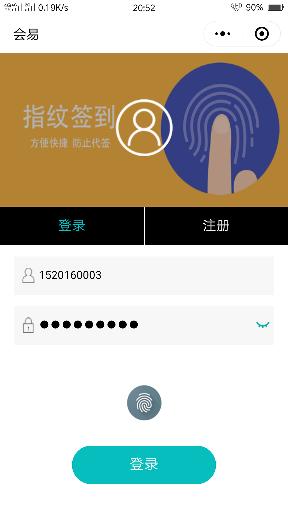
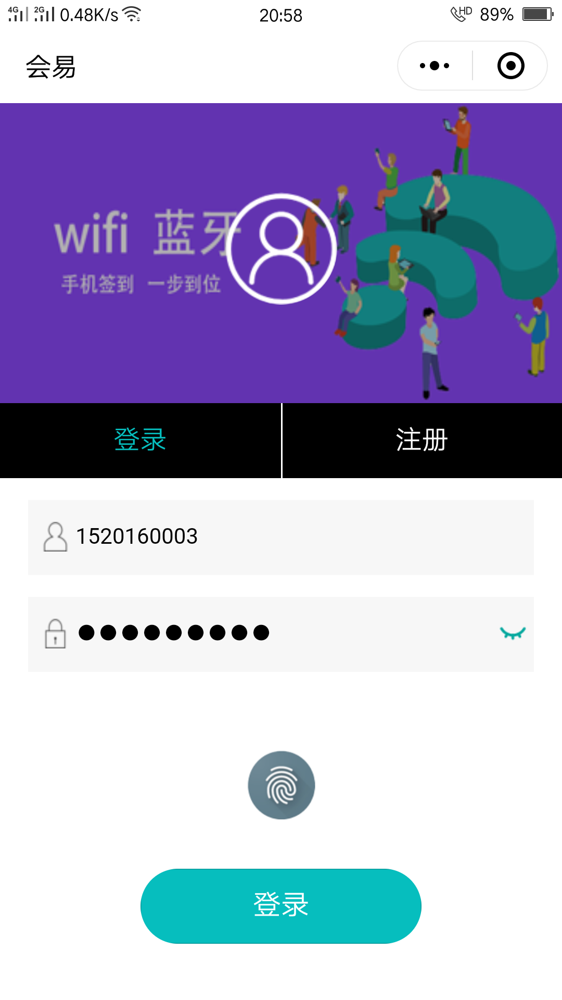
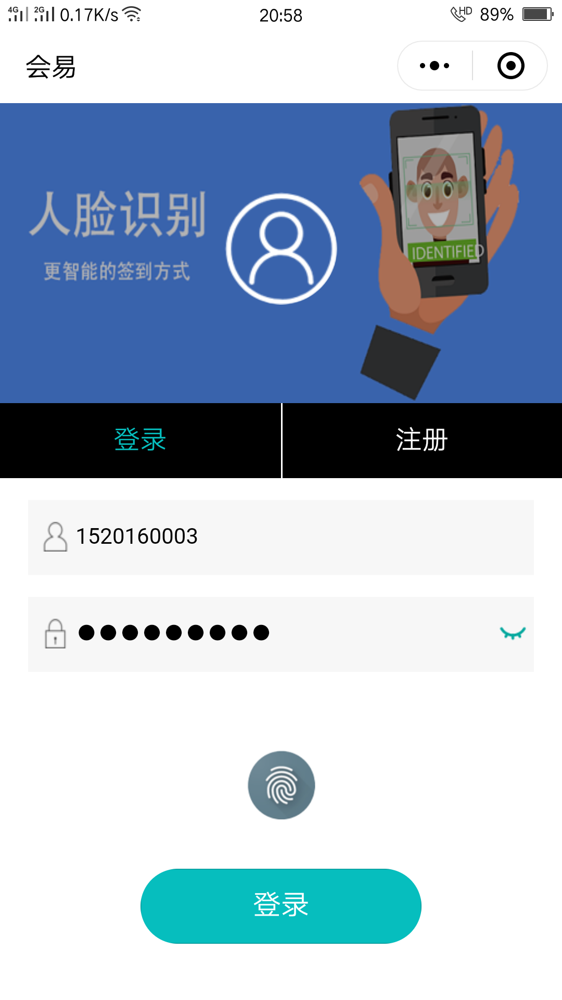
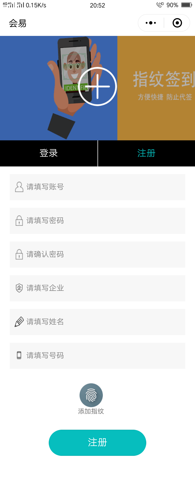
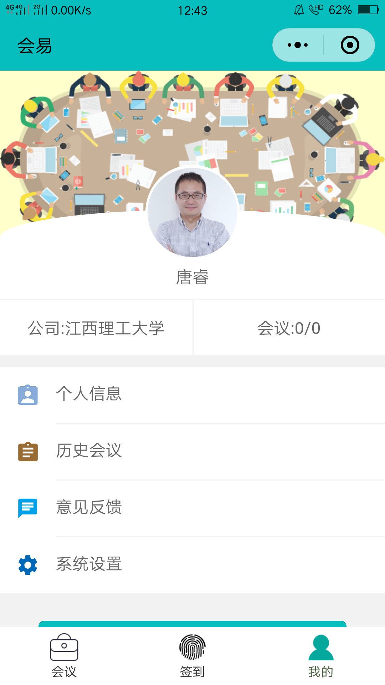
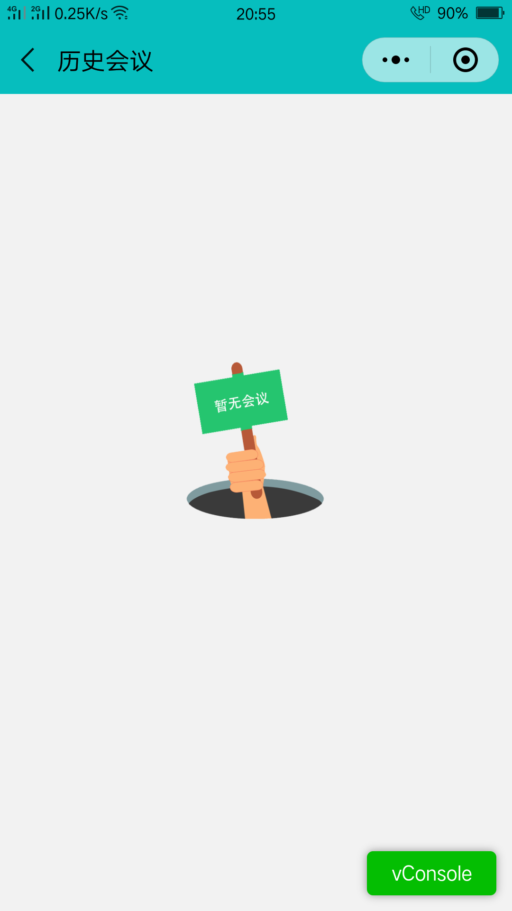
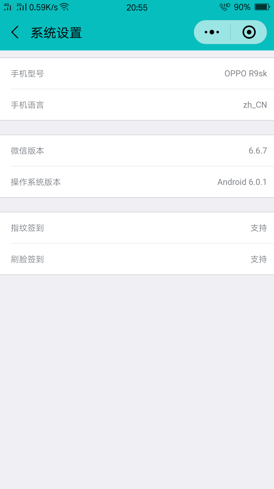
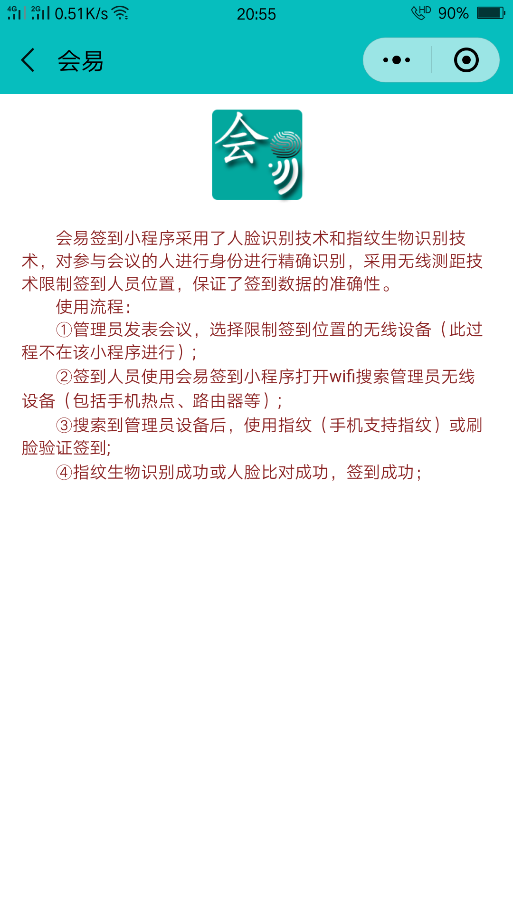
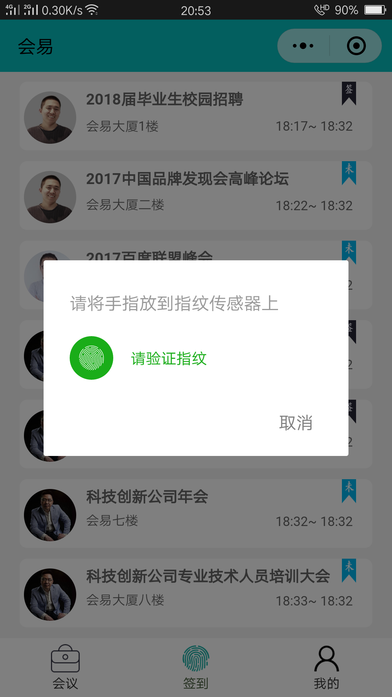
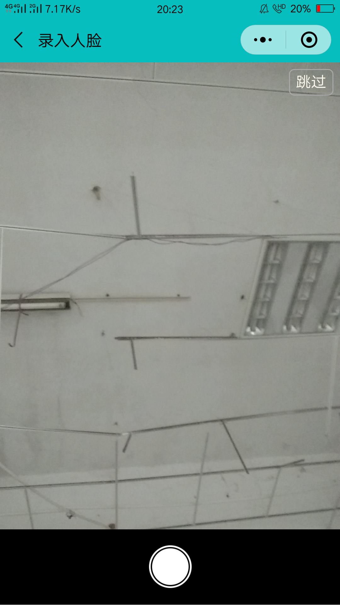

小程序信息

- 分类：办公
- 所属平台：微信

体验方式

1. 使用手机微信APP扫描页面上方二维码体验；
2. 在手机微信APP中搜索“会易签到”即可进入小程序;

会易签到小程序截图

---

---

---

---

---

---

---

小程序简介

会易项目（包括安卓客户端、微信端、pc端）是一款基于B2B模式，集会议发布、会议签到、会议管理于一体的，为打造一个方便快捷的会议签到平台而生的项目。而会易签到小程序是项目的一个重要部分，会易签到小程序是与会人员签到的重要终端，小程序用完即走的优势非常适合会议签到场景。微信小程序连接了线下会议签到，连接了公司会议办公。会易签到小程序成为会议办公的小助手。
会易签到小程序是方便与会人员签到的工具，小程序采用人脸识别技术和指纹生物识别技术对签到用户进行身份验证，利用基于无线的室内测距技术将签到用户限制在会场范围内，为企业、组织管理员提供了准确的会议签到数据。会易签到小程序也为用户搭建了一个了解和管理自己应该参加的会议的平台，通过会易签到小程序签到用户可以在会场的任意位置方便快捷进行会议签到，解决了用户排队签到的苦恼，打破了传统“签到处”的概念。

会易签到视频简介

<iframe frameborder="0" src="https://v.qq.com/txp/iframe/player.html?vid=g068032qqav" allowFullScreen="true"></iframe>